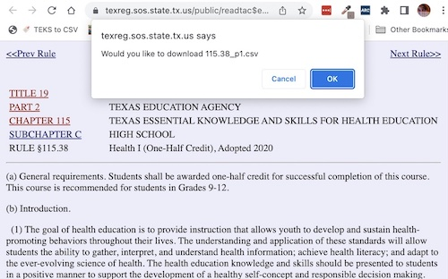

# teks-to-csv-bookmarklet
A JavaScript bookmarklet that generates a CSV of the Texas Essential Knowledge and Skills (TEKS). It is designed for use with the [TAC Viewer](https://texreg.sos.state.tx.us/public/readtac$ext.ViewTAC?tac_view=3&ti=19&pt=2) hosted by the Texas Secretary of State. 

## Installation
Drag and drop the following link into your bookmarks bar: 

<a href="javascript:(function()%7Bvar%20jsCode%20%3D%20document.createElement(%27script%27)%3BjsCode.setAttribute(%27src%27%2C%20%27https%3A%2F%2Fcdn.jsdelivr.net%2Fgh%2FRegion13%2Fteks-to-csv-bookmarklet%40master%2Fscript.js%27)%3Bdocument.body.appendChild(jsCode)%3B%7D())%3B%0A">🔖 TEKS to CSV</a>

## Usage
1. In the [TAC Viewer](https://texreg.sos.state.tx.us/public/readtac$ext.ViewTAC?tac_view=3&ti=19&pt=2), Navigate to the TEKS Rule you would like to convert to a CSV file. For example: [RULE §115.38, Health I (One-Half Credit)](https://texreg.sos.state.tx.us/public/readtac$ext.TacPage?sl=R&app=9&p_dir=&p_rloc=&p_tloc=&p_ploc=&pg=1&p_tac=&ti=19&pt=2&ch=115&rl=38)
2. To run the code, simply click the '🔖 TEKS to CSV' bookmarklet in your bookmarks bar. An alert will appear and invite you to download the CSV file. 
3. If the rule is split across an additional webpage, a second alert will appear inviting you to go to the next page. Click OK. 
4. Once you have navigated to the next page, click the 'TEKS to CSV' bookmarklet again to download the additional page of the CSV.

## Note
This bookmarket has only been tested with the following TEKS Chapters:

* [Chapter 115: Health Education](https://texreg.sos.state.tx.us/public/readtac$ext.ViewTAC?tac_view=4&ti=19&pt=2&ch=115)
* [Chapter 116: Physical Education](https://texreg.sos.state.tx.us/public/readtac$ext.ViewTAC?tac_view=4&ti=19&pt=2&ch=116)
* [Chapter 112: Science](https://texreg.sos.state.tx.us/public/readtac$ext.ViewTAC?tac_view=4&ti=19&pt=2&ch=112)

Further testing may be required for future chapters. 

---

[View on GitHub](https://github.com/Region13/teks-to-csv-bookmarklet)